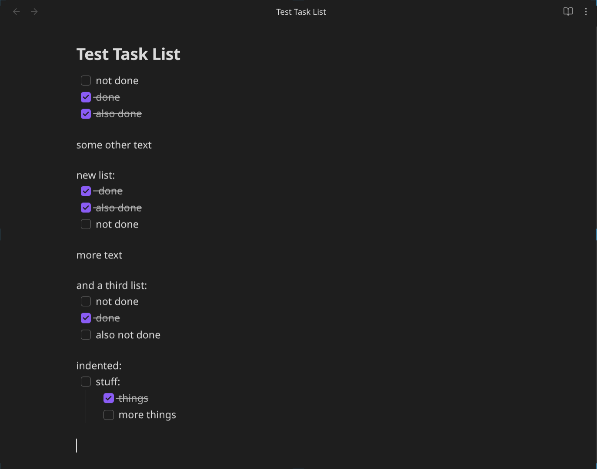
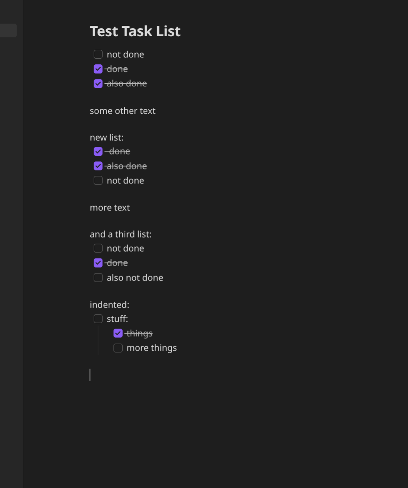

# Delete Checked Items

A simple plugin for Obsidian that adds the ability to delete all checked checklist items in a note with a single action. The action is available as a command and in the file menu.

Works on desktop as well as mobile.

### Example Usage

| file menu                                      | command                                    |
| ---------------------------------------------- | ------------------------------------------ |
|  |  |